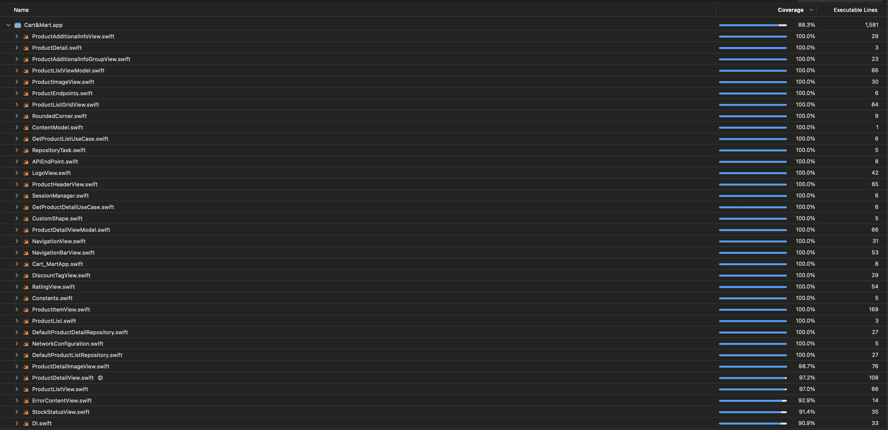

  

# Cart & Mart (Dummy Application)

## Overview
Cart & Mart is sample application developed with SwiftUI, which provides user-friendly interface to explore limited list of products and it's detail.

## Key Aspects Followed
- Clean Architecture with MVVM & DI
- SwiftUI + Combine
- Designed for scalability 
- Modular code
- Unit Testing + UI Testing + Snapshot Testing (88.3% Code-Coverage)
- Accessibility

## API Details

This App is using public apis. Find the api details by following link:

Website: https://dummyjson.com/docs/products

## App Demo

## Code Coverage Screenshot

| Code Coverage                             |
| -------------------------------------- |
|  |
